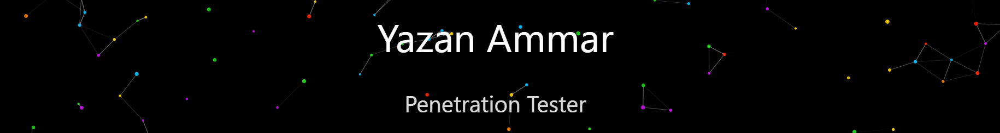

### Languages

---

  

    
    
  

---

<h2 style="color: #58a6ff; border-bottom: 2px solid #30363d; padding-bottom: 10px;">My Projects</h2>

<table style="width:100%; border-collapse: collapse; background: none; border: none;">
  <tbody>
    <tr style="border-bottom: 1px solid #21262d;">
      <td style="width: 60px; padding: 15px 10px; text-align: center;">
        
      </td>
      <td style="padding: 15px 10px; vertical-align: middle;">
        <strong style="font-size: 1.2em; color: #c9d1d9;">Info-Domain & IP</strong>
        
         
        A comprehensive DNS recon tool for pentesters to simplify information gathering.
      </td>
      <td style="width: 120px; padding: 15px 10px; text-align: right;">
        <a href="https://github.com/YazanAmmar/Info-Domain-IP" title="Explore Project" style="text-decoration: none; padding: 8px 12px; background-color: #238636; color: white; border-radius: 6px; font-size: 0.9em; font-weight: bold;">
          Details
        </a>
      </td>
    </tr>
    <tr style="border-bottom: 1px solid #21262d;">
      <td style="width: 60px; padding: 15px 10px; text-align: center;">
        
      </td>
      <td style="padding: 15px 10px; vertical-align: middle;">
        <strong style="font-size: 1.2em; color: #c9d1d9;">SyncEveryThing</strong>
        
         
        A smart, high-performance C++ utility for robust and intelligent file synchronization.
      </td>
      <td style="width: 120px; padding: 15px 10px; text-align: right;">
        <a href="https://github.com/YazanAmmar/SyncEveryThing" title="Explore Project" style="text-decoration: none; padding: 8px 12px; background-color: #8957e5; color: white; border-radius: 6px; font-size: 0.9em; font-weight: bold;">
          Details
        </a>
      </td>
    </tr>
    <tr>
      <td style="width: 60px; padding: 15px 10px; text-align: center;">
        
      </td>
      <td style="padding: 15px 10px; vertical-align: middle;">
        <strong style="font-size: 1.2em; color: #c9d1d9;">Color Master</strong>
        
         
        An Obsidian plugin that gives you full control over your workspace's UI colors and design.
      </td>
      <td style="width: 120px; padding: 15px 10px; text-align: right;">
        <a href="https://github.com/YazanAmmar/obsidian-color-master" title="Explore Project" style="text-decoration: none; padding: 8px 12px; background-color: #d29922; color: white; border-radius: 6px; font-size: 0.9em; font-weight: bold;">
          Details
        </a>
      </td>
    </tr>
  </tbody>
</table>

